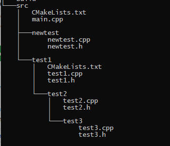

# CMake_Cmake2VsIDE
Map the file tree into the IDE

## Key
```CMake
source_group(${groupname} FILES ${dircode})
```
## How to Use
```CMake
SrcCodeGroup(${PROJECT_SOURCE_DIR})
FolderTraRCS_GetCode(allcode ${PROJECT_SOURCE_DIR})
add_executable (Demo ${allcode})
```
## Picture



